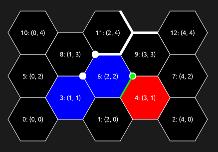

# hexgrid

A crate for working with hexagonal grids, such as might commonly be used to
represent the map in a strategy game like Civilization or Settlers of Catan.

Refer to the crate-level documention for reference, and the included example
code to show how this crate can be used in a real application.

