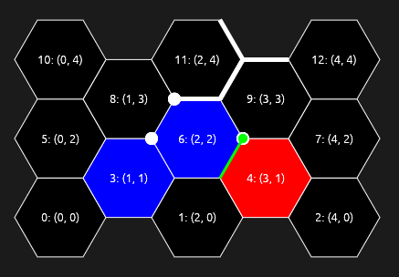

# hexgridrect

A crate for working with rectangular grids tiled with hexagons, such as might
commonly be used to represent the map in a strategy game like Civilization or
Settlers of Catan.

Refer to the crate-level documention for reference, and the included example
code to show how this crate can be used in a real application.

## Compaison to Other Crates

Several existing crates implement similar functionality, the most mature of
which appears to be [`HexGridSpiral`](https://crates.io/crates/hexgridspiral) and
[`hexagonal_pathfinding_astar`](https://crates.io/crates/hexagonal_pathfinding_astar).

The distinguishing feature of this crate are:

- Use of rectagular coordinates
- Use of a rectangular grid
- Support for attaching data to edges and corners of hexagons

# References

- [Hexagonal Grids](https://www.redblobgames.com/grids/hexagons/) from Red Blob Games

